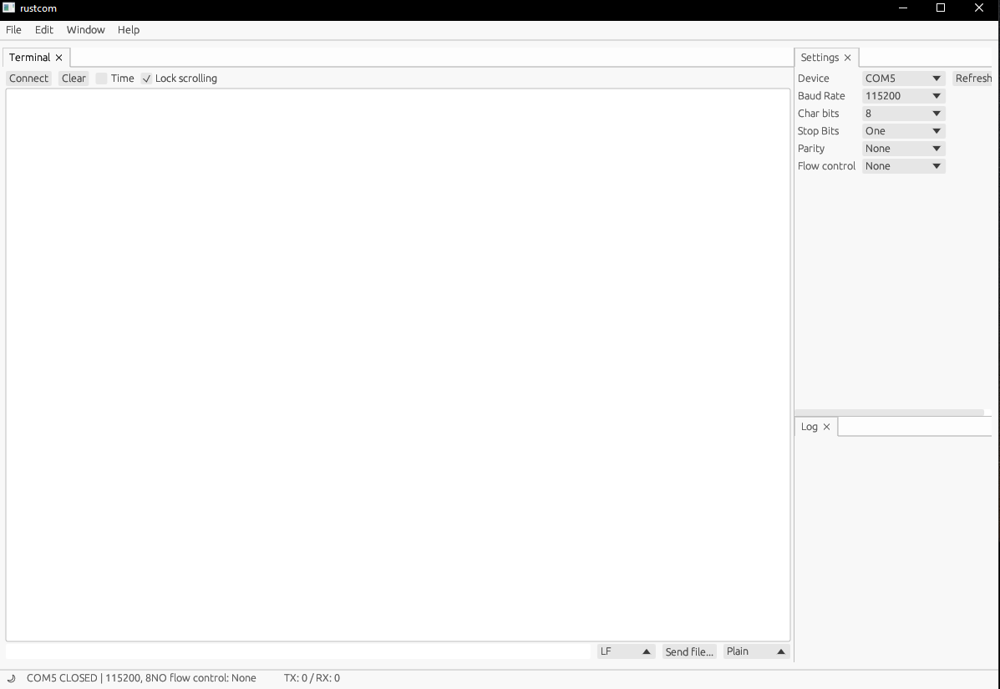
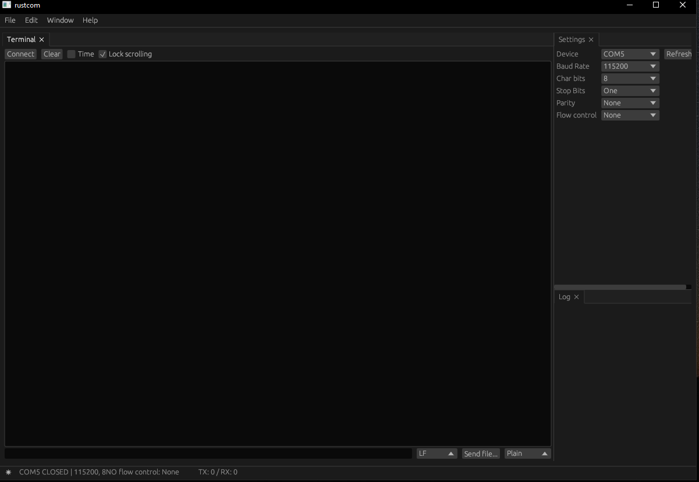

# ***Welcome to rustcom***

Rustcom is a graphical serial terminal similar to minicom. It runs on Linux and Windows (tested) but should also work on Mac OS X and other systems.

# ***Features***
- a cute GUI ;-)
- built-in dark theme support
- no cryptic keyboard shortcuts
- configurable line end characters (LF, CR, LFCR)
- sending files as plain text, xmodem or ymodem
- recording to a text file


# ***Who's it for?***
Rustcom is primarily intended for technical users and hardware hackers who need to communicate with embedded systems, test equipment, and serial consoles. It offers clean and simple GUI that works on all platforms.

# ***Building from source***
To build Rustcom from source, you will need a recent Rust toolchain (MSRV 1.60) installed on your system. Once you have the required tools installed, generate a release build by running ```cargo build --release``` in the root repository folder. Please note that this process may take a while to complete.

# ***Screenshots***
Light theme

Dark theme

