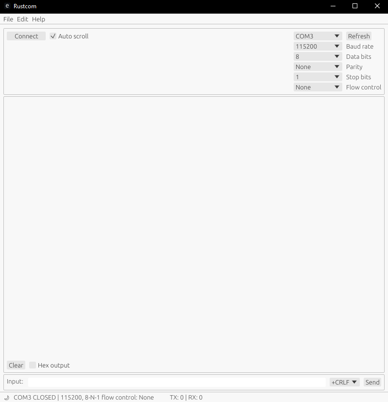
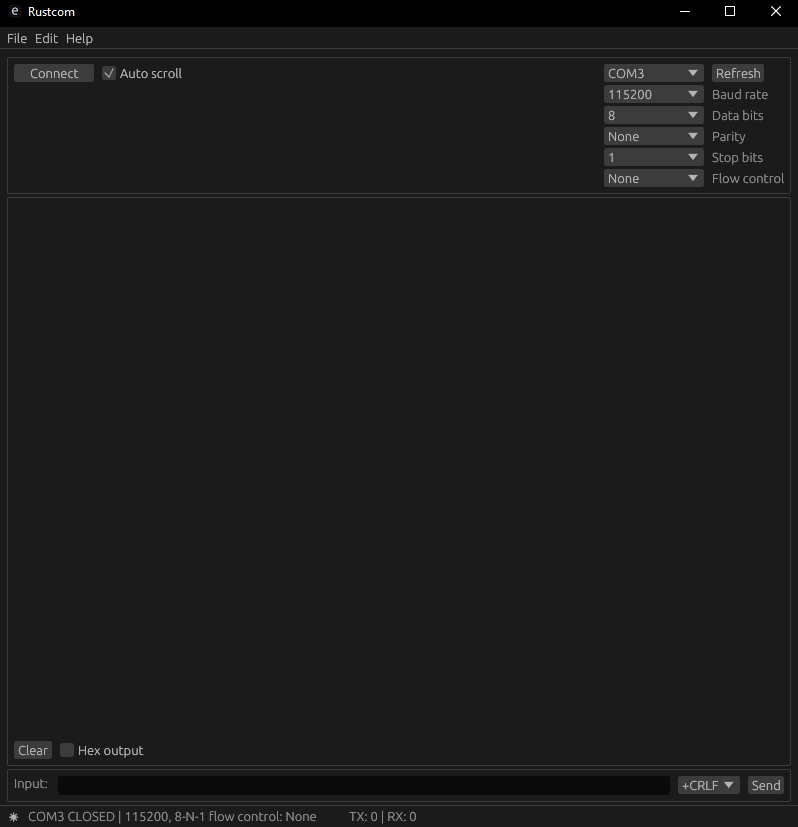

[](https://github.com/ullnorse/rustcom/actions/workflows/ci.yml)
[](https://crates.io/crates/rustcom)
[](https://opensource.org/licenses/MIT)
[](https://www.rust-lang.org)
[](https://github.com/ullnorse/rustcom)
[](https://github.com/emilk/egui)
# Rustcom

A cross-platform graphical serial terminal for embedded systems development and hardware debugging.

## Overview

Rustcom provides a clean interface for serial communication without cryptic keyboard shortcuts or complex configuration. It runs on Linux, Windows, and macOS.

## Features

- Cross-platform GUI built with egui
- Light and dark theme support
- Configurable line endings (LF, CR, CRLF)
- Hex output view
- Command-line configuration support
- Real-time serial data monitoring

## Installation

### Prerequisites

- Rust toolchain (1.60 or later)
- [just](https://github.com/casey/just) command runner (optional, recommended)

### Building from Source

Clone the repository and build:

```bash
git clone https://github.com/ullnorse/rustcom.git
cd rustcom
cargo build --release
```

The compiled binary will be in `target/release/rustcom`.

### Using just

If you have `just` installed:

```bash
just release    # Build release binary
just run        # Run in debug mode
just test       # Run tests
just ci         # Run all checks
```

Run `just` to see all available commands.

## Usage

### GUI Mode

Run without arguments to open the graphical interface:

```bash
rustcom
```

### Command Line Options

Configure serial settings via command line:

```bash
rustcom --device COM1 --baudrate 115200
rustcom --device /dev/ttyUSB0 --baudrate 9600 --parity even
```

Available options:

```
  -d, --device <DEVICE>              Serial device name
  -b, --baudrate <BAUDRATE>          Baud rate [default: 115200]
  -t, --data-bits <DATA_BITS>        Data bits: 5, 6, 7, 8 [default: 8]
  -p, --parity <PARITY>              Parity: none, odd, even [default: none]
  -f, --flow-control <FLOW_CONTROL>  Flow control: none, software, hardware [default: none]
  -s, --stop-bits <STOP_BITS>        Stop bits: 1, 2 [default: 1]
```

## Development

### Quick Start

```bash
just setup      # Install development tools
just test       # Run tests
just fmt        # Format code
just ci         # Run all checks
```

### Running Tests

```bash
cargo test
# or
just test
```

### Code Quality

```bash
cargo fmt       # Format code
cargo clippy    # Lint code
# or
just ci         # Run all checks (tests, format, clippy, build)
```

### Before Committing

Run the CI pipeline locally to catch issues:

```bash
just ci-strict  # Runs the same checks as CI
```

## Architecture

- `src/app.rs` - Main application state and logic
- `src/serial.rs` - Serial port communication and threading
- `src/ui/` - UI components (menu, status bar, windows)
- `src/cli.rs` - Command-line argument parsing
- `src/logger.rs` - Custom logging implementation

## License

MIT License - see [LICENSE](LICENSE) for details.

## Contributing

Contributions are welcome. Please ensure:

- Tests pass: `just test`
- Code is formatted: `just fmt`
- No clippy warnings: `just ci-strict`

## Screenshots

### Light Theme


### Dark Theme

